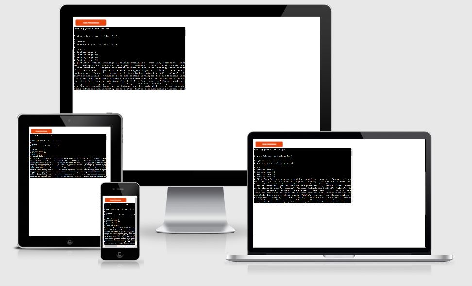
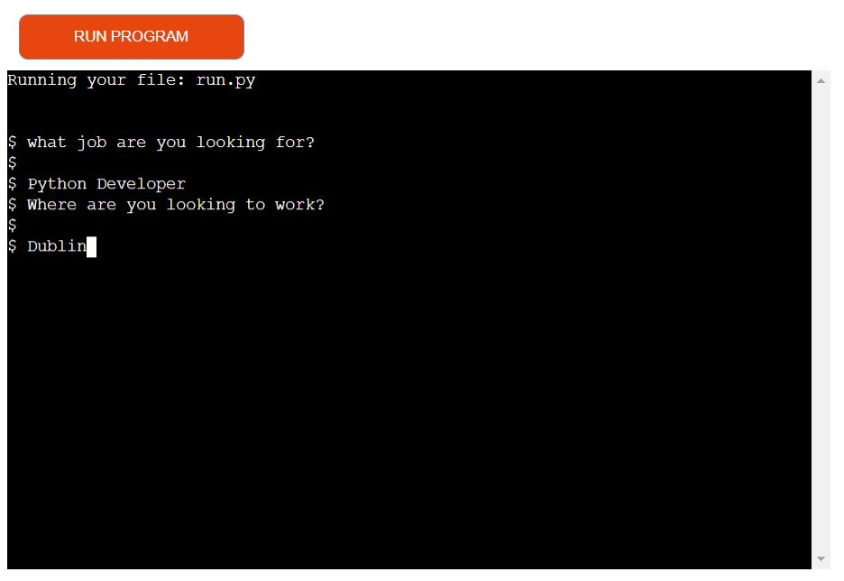
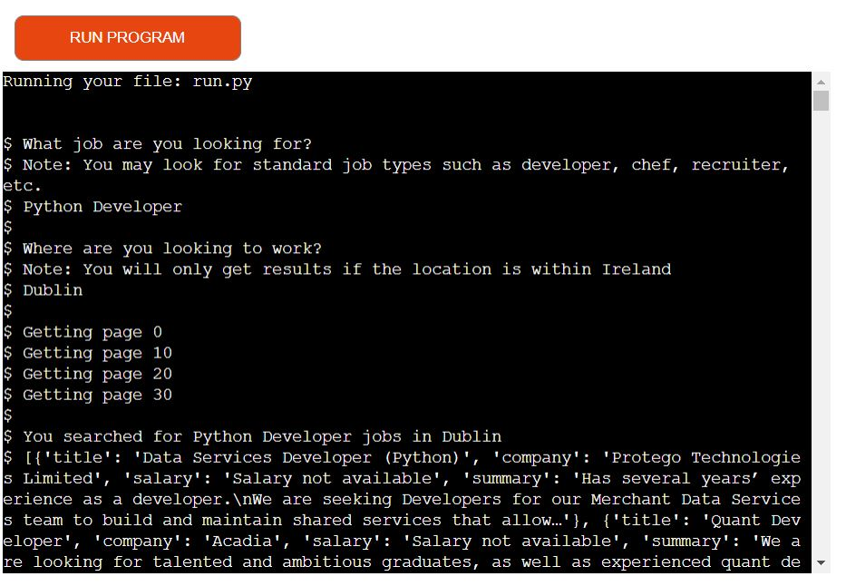
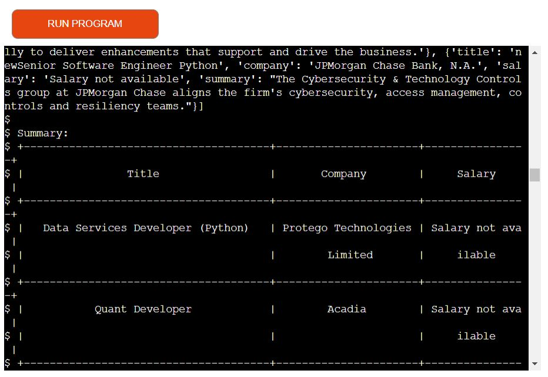
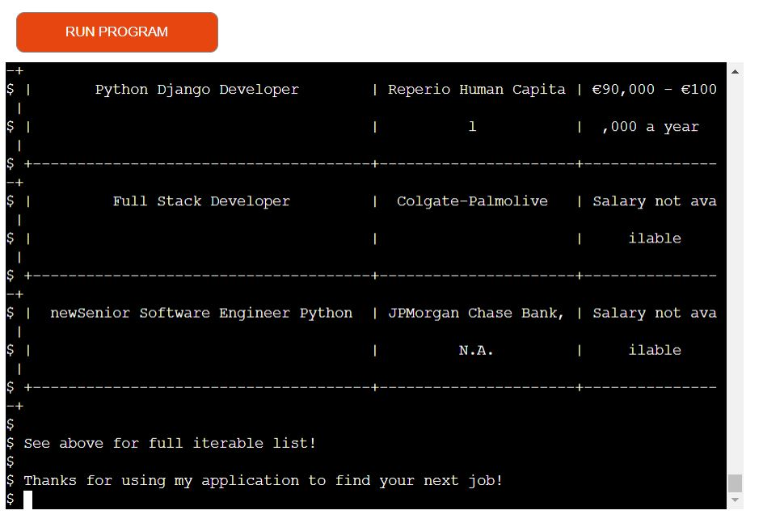
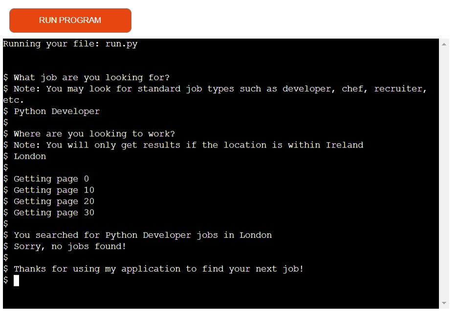

# INDEED WEB SCRAPER

## Description: Code Institute Student Project 3: 

A program that successfully scrapes job information from the indeed.com website.
<br>
It showcases my python ability.

A live program can be found [here](https://kevs-project-portfolio-3.herokuapp.com/).



# Table of Contents
- [1. Introduction](#introduction)
- [2. How to use](#How-to-use)
- [3. Data Model and Technologies](#Data-Model-and-Technologies)
- [4. Testing](#testing)
- [5. Bugs](#bugs)
- [6. Future Updates](#future-updates)
- [7. Contribution Links](#contribution-links)
- [8. Deployment](#deployment)


<a name="introduction"></a>

# 1. Introduction
[Go to the top](#table-of-contents)

This is the first python program I have built and is part of my project portfolio required in the Full-Stack Software Development Diploma I am currently undertaking.
The aim of this program is to scrape job information from the indeed.com website:
- The program should allow the user to input the type of job they are looking for and the location they would like that job to be in.
- It must be noted that the locaction must be in Ireland.
- The program should scrape the following information:
    1. The Job Title.
    2. The name of the Company that are hiring for the job.
    3. The Salary being offered for the job if available.
    4. A Summary giving a description of the role on offer.
- All information will be outputted to the terminal and the "Title", "Company" and "Salary" will also be put into a table.

## Purpose

The pupose of this webscraper is to allow the user to have quick accessibility to job data for a specific job type in Ireland.
<br>
It allows to user to group the "Title", "Company" and "Salary" in a summary table to be further analysed.
<br>
This webscraper would be benefical for the recruitment industry and job seekers as it outputs useful data with reletive speed.

<a name="How-to-use"></a>

# 2. How to use
[Go to the top](#table-of-contents)

When the program is run, the user will be asked two questions:   

1. What job are you looking for?
2. Where are you looking to work?

The first question asks the user to input the job they are looking for, the program then adds that input to the job_type section in the URL. 
<br>
The second question asks the user to input the location they would the job to be in, the program then adds that input to the location section in the URL.
<br>
When the user inputs there details the program requests this information from the first five pages of the indeed.com website.
<br>
url = 'https://ie.indeed.com/jobs?q={job_type}&l={location}&start={page}'
<br>
The page section in the above URL requests the page which steps in 10, meaning:

- Page 1 = 0
- Page 2 = 10
- Page 3 = 20 and so on

<br>
Once the user runs the program and makes a request, the program will scrape the requested information and output it to the terminal in an iterable list.
<br>
The list has four headings:
<br>

1. Title
2. Company
3. Salary
4. Summary 
<br>

The program will return information on each of the headings accept for the Salary heading on occasions where the salary is not posted by the company advertising.
<br> 
On occasions where the salary is not posted by the company the program will still post the heading followed by "Salary not available".
<br>
The program will also create a summary table with the headings "Title", "Company" and "Salary" which provides a nice format for the user to quickly inspect ouput.
<br>
If the user requests a job that is not available or a job in a location outside of Ireland, the program will inform the user:
<br>
"You searched for 'job type' in 'location'" 
<br>
"Sorry, no jobs found!"


## Walk Through

The following is a walk through with images on how to run the program:

1. Question: What job are you looking for? Answer: Python Developer, and press enter on the keyboard.
2. Question: Where are you looking to work? Answer: Dublin



3. Once the user has answered the two questions and presses enter on the keyboard, the program will run and output the requested information. The iterable list is first loaded.



4. Followed by the summary table with the headings "Title", "Company" and "Salary". Below the table the user is thanked for uaing the program. 




5. If the user enters a location outside of Ireland, the program outputs the following: 



<a name="Data-Model-and-Technologies"></a>

# 3. Data Model and Technologies
[Go to the top](#table-of-contents)

The Data model used within this program is displaying an object as an array.
<br>
The program runs a function that loops through each "div", "h2" and "span" tag that we want to scrape on the indeed website to pull out the respective information.
<br>
This is achieved with the help of the following modules:

- Requests
- Beautiful Soup
- Beautiful table
- Pandas


### 1. Requests:
The requests module allows you to send HTTP requests using Python.
<br>
The HTTP request returns a Response Object with all the response data (content, encoding, status, etc).

### 2. Beautiful Soup:
Beautiful Soup is a Python library that is used for web scraping purposes to pull the data out of HTML and XML files. 
<br>
It creates a parse tree from page source code that can be used to extract data in a hierarchical and more readable manner.

### 3. Beautiful table:
This Package provides BeautifulTable class for easily printing tabular data in a visually appealing format to a terminal.

### 4. Pandas:
Pandas is a software library written for the Python programming language for data manipulation and analysis. It is an open source package. 
<br>
It is built on top of another package named Numpy, which provides support for multi-dimensional arrays.

<a name="Testing"></a>

# 4. Testing
[Go to the top](#table-of-contents)

## PEP8 Validation Testing 

I used the [PEP8 online](http://pep8online.com/) validator to check my code for errors:

#### Errors Found:

1. Code: E501	Line: 12	Column: 80	Error Description: line too long (139 > 79 characters).
Unable to fix error as this is my User-Agent string.

2. Code: E501	Line: 52	Column: 80	Error Description: line too long (87 > 79 characters).
Unable to fix error as this is a note to help the user.


## Manual Testing

- When the program is run the user is prompted with the question "What job are you look for?". It worked as expected.
For testing purposes the user answered "Python Developer".

- When the user submits an answer to the "What job are you look for?" question, the user is then prompted by another question "Where are looking to work?". It worked as expected.
For testing purposes the user answered "Dublin".

- When the user submits an answer to the "Where are looking to work?" question, the program will scrape the first four pages of the indeed.com website and return a list
with four headings:

1. Title
2. Company
3. Salary
4. Summary 
<br>

- The program will return information on each of the headings accept for the Salary heading on occasions where the salary is not posted by the company advertising.
<br> 
On occasions where the salary is not posted by the company the program will still post the heading followed by "Salary not available". It worked as expected.

- The program will also output a table with the headings "Title", "Company" and "Salary". It worked as expected.

- If the user requests a job that is not available or a job in a location outside of Ireland, the program will inform the user:
<br>
"You searched for 'job type' in 'location'". 
<br>
"Sorry, no jobs found!". It worked as expected.


<a name="Bugs"></a>

# 5. Bugs
[Go to the top](#table-of-contents)

- In the transform function, the except statement was reporting up an error saying ```except``` cannot be left bare. I then changed it to ```except Exception as ex```. Bug fixed.
- When I first deployed my program to Heroku it would not run as the requests module did not load into the requiremnts table when I ran ```Pip3 freeze > requirements.txt```. 
I added the requests module manually to the requirements file and deployed the program succesfully. Bug fixed.
- When I deployed my program to Heroku the program works as it's supposed to, but when I searched in locations outside of Ireland, the program returns:
<br>
"You searched for 'job type' in 'location'" 
<br>
"Sorry, no jobs found!" as expected.
<br>
When I searched for within Ireland again, the program continued to return:
<br>
"You searched for 'job type' in 'location'" 
<br>
"Sorry, no jobs found!" again.
<br>
This issue only happened when I deployed to Heroku, when I run it in the GitHub terminal it works as expected. I re-deployed my program to Heroku. Bug fixed.

- The User Agent URL in the extract function is reporting up an error saying the line is too long. Bug not fixed.
- the ```print("Note: You may look for standard job types such as developer, chef, recruiter, etc.")``` line is reporting up an error saying the line is too long. Bug not fixed.


<a name="future-updates"></a>

# 6. Future Updates

[Go to the top](#table-of-contents)

1. Currently the program only runs on the Irish indeed website, a program that runs on multiple country locations may provide a better user experience.

2. By using the pandas data frame it's possible to send the scrapped information to a CSV for further analysis or to store for future use.
<br>
This can be acheived by:
 
   1. Installing the pandas data frame ```pip install pandas```. 
   2. Import the pandas module by writing ```import pandas as pd``` at the top of the run.py file underneath ```from bs4 import BeautifulSoup```.
   3. Write the following comment and code at the bottom of the run file:
   <br>


   ```# Panda dataframe sends the scraped data to the jobs CSV file```
   <br>
   ```df = pd.DataFrame(joblist)```
   <br>
   ```print(df.head())```
   <br>
   ```df.to_csv('jobs.csv')```
   <br>
   <br>

3. Create a CSV file called "jobs" in the directory and run the program.
The Headings will be printed in the terminal while the data will be stored in the CSV.

<a name="contribution-links"></a>

# 7. Contribution Links

[Go to the top](#table-of-contents)

- [Python Docs](https://www.python.org/)
- [Python Tutor](http://www.pythontutor.com/visualize.html#mode=edit)
- [PEP8 online](http://pep8online.com/)
- [Real Python](https://realpython.com/beautiful-soup-web-scraper-python/)
- [Towards Data Science](https://towardsdatascience.com/scrape-company-reviews-ratings-from-indeed-in-2-minutes-59205222d3ae)
- [Geeks for Geeks](https://www.geeksforgeeks.org/scraping-indeed-job-data-using-python/)

 <a name="deployment"></a>

# 8.	Deployment

[Go to the top](#table-of-contents)

This program was deployed via Heroku. The following steps explain the deployment process:

- Update the requirements file so Heroku recognises what modules are installed (my program depends on these modules to run).
<br>
  To update the requirements file type: ```Pip3 freeze > requirements.txt``` into the terminal and the requirements file will update with your dependencies.

- Open the Heroku account and click "create new app"
- Click on the setting tab and then click on the "buildpack" button.
- Add "nodejs" and the "python" build pack and save the changes.
- Click on the "deploy" tab and click on the GitHub button.
- Enter the GitHub repository name and click "connect". This will link up the Heroku app to the GitHub repository code.
- Click on the "Manual Deploy" and you will see the app being built. Once built, click view and a page will open with the program on it.
- Test to see that the program runs as it should.
- Finally, click on the "Enable Automatic Deploys" button so any new updates will update automatically when a push to GitHub is performed.
- The program is now deployed.