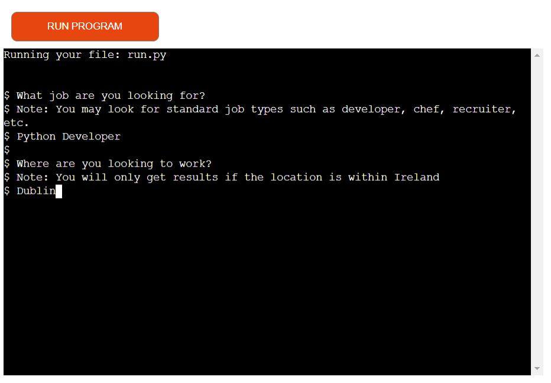

# INDEED WEB SCRAPER

## Description: Code Institute Student Project 3: 

A program that successfully scrapes job information from the indeed.com website 
It showcases my python ability.

A live programe can be found [here](https://kevs-project-portfolio-3.herokuapp.com/).

# Table of Contents
- [1. Introduction](#introduction)
- [2. How to use](#How-to-use)
- [3. Testing](#testing)
- [4. Bugs](#bugs)
- [5. Future Updates](#future-updates)
- [6. Contribution Links](#contribution-links)
- [7. Deployment](#deployment)

# 1. Introduction
[Go to the top](#table-of-contents)

This is the first python program I have built and is part of my project portfolio required in the Full-Stack Software Development Diploma I am currently undertaking.
The aim of this program is to scrape job information from the indeed.com website:
- The program should allow the user to input the type of job they are looking for and the location they would like that job to be in.
- The program should scrape the following information:
    1. The Job Title.
    2. The name of the Company that are hiring for the job.
    3. The Salary being offer for the job if available.
    4. A Summary giving a description of the role on offer.
- The first five job heading will be sent to terminal to show that the program run successfully.
- The program will send the the scraped data of the first five pages of the Indeed website and populate the jobs.csv file with it for analysis by the user.

# 2. How to use
[Go to the top](#table-of-contents)

When the program is run, the user will be asked to questions:   

1. what job are you looking for?
2. Where are you looking to work?

The first question asks the user to input the job they are looking for, the program then adds that input to job title section in the url. 
 
The second question asks the user to input the location they would the the job to be in, the then adds that input to the location section in the url.
 
Once the user inputs there details the program requests this information from the first five pages of the indeed.ie website
 
url = 'https://ie.indeed.com/jobs?q={job_type}&l={location}&start={page}'
 
The page section in the above url requests the page which steps in 10 meaning:

- Page 1 = 0
- Page 2 = 10
- Page 3 = 20 and so on

 
Once the user runs the program and makes a request, the program will scrape the requested information and output it to the terminal in an appended list.
 
The list has four headings:

1. Title
2. Company
3. Salary
4. Summary 
 

The program will return information on each of the headings accept for the Salary heading on occasions where the salary is not posted by the campany advertising.
  
On occasions where the salary is not posted by the campny the program will still post the heading followed by "Salary not available".

## Walk Through

The following is a walk through with images on how to run the program:

1. Question: What job are you looking for? Answer: Python Developer, and press enter on the keyboard.
2. Question: Where are you looking to work? Answer: Dublin

3. Once the user has answered the two questions and presses enter on the keyboard the program will run and output the requested information.

# 3. Testing
[Go to the top](#table-of-contents)

# 4. Bugs
[Go to the top](#table-of-contents)

# 5. Future Updates

[Go to the top](#table-of-contents)

1. Currently the program only runs on the irish indeed website, a progam that runs on there world wide, my provide a better user experience

2. use the pandas module to create a dataframe and send to scrapped information to a csv for further analysis or for storage purposes with the following code:

 Panda dataframe sends the scraped data to the jobs csv file
 df = pd.DataFrame(joblist)
 print(df.head())
 df.to_csv('jobs.csv')